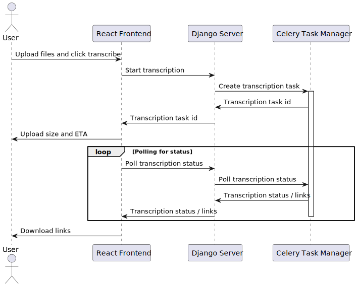

# Transcriber-gui
Graphical User Interface for the transcriber application. The GUI is built using React, Django and Celery.
The application uses a task manager in the backend for the long-running transcription task. This way there will not be long-running http requests, which would break during attempted user reloading of the page.
The following figure shows a sequence diagram of the interaction.



### Setting up the environment for development

To run the development React server you need to install node and npm

``` bash
sudo apt install node npm python3-django
```

Create a Python environment for your project, go to the transcriber-gui directory and create it

``` bash
python3 -m venv .venv
```
and activate it
``` bash
source .venv/bin/activate
```
Now install the needed python libraries
``` bash
pip install django djangorestframework django-cors-headers celery redis
```

Create the folders for managing file uploads and output
``` bash
cd transcriber-gui/django-project
mkdir media
cd media
mkdir uploads
```

Prepare and start the Django backend.
Firstly create an environment file for test in the "transcriber-gui/django-project" directory called ".env" with the following content
```
SECRET_KEY='django-insecure-wr3t_w3m5qmgzn(4&f*5uhq*kqd^f21eu!p84jl0dw!8y*=e=^'
DEBUG=True
```
Next migrate the database and start the development server
``` bash
cd django-project
python manage.py makemigrations transcriber
python manage.py migrate
python manage.py runserver
```

In a new terminal start a celery worker (for consuming transcription tasks)
``` bash
cd transcriber-gui
source .venv/bin/activate
cd django-project
python -m celery -A django-project worker
```

Checkout and install the transcriber Python application
``` bash
cd transcriber
git clone --depth 1 --single-branch --recursive --shallow-submodules -b "V1.4" https://github.com/aau-claaudia/transcriber.git aau-whisper
pip install --no-cache-dir numpy==1.26.4
pip install --no-cache-dir faster-whisper==1.0.0
cd aau-whisper
pip install -r requirements.txt
pip install -e .
```

We also need to install a few npm packages
``` bash
cd transcriber-gui/django-project/frontend
npm install react-scripts react-dropzone axios react-spinners
```

In a new terminal start the React development server
``` bash
cd transcriber-gui/django-project/frontend/
npm start
```
