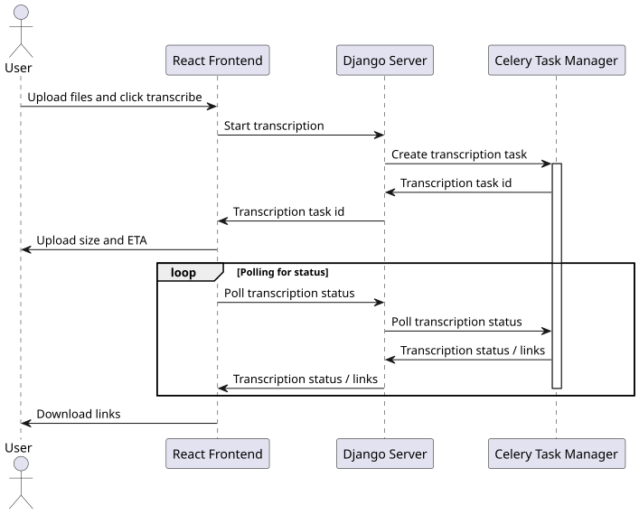

# Transcriber-gui
Graphical User Interface for the transcriber application. The GUI is built using React, Django and Celery.
The application uses a task manager in the backend for the long-running transcription task. This way there will not be long-running http requests, which would break during attempted user reloading of the page.
The following figure shows a sequence diagram of the interaction.



### Setting up the environment for development

To run the development React server you need to install node (v24) and npm

``` bash
sudo apt install node npm python3-django
```

Create a Python environment for your project, go to the transcriber-gui directory and create it

``` bash
python3 -m venv .venv
```
and activate it
``` bash
source .venv/bin/activate
```
Now install the needed python libraries
``` bash
pip install django django-cors-headers celery redis python-dotenv torch
```

Create the folders for managing file uploads and output
``` bash
cd transcriber-gui/django-project
mkdir media
cd media
mkdir uploads
```

Prepare and start the Django backend.
Firstly create an environment file for test in the "transcriber-gui/django-project" directory called ".env" with the following content
MEMORY_IN_GIGS is used for determining the usable whisper models.
```
SECRET_KEY='django-insecure-wr3t_w3m5qmgzn(4&f*5uhq*kqd^f21eu!p84jl0dw!8y*=e=^'
DEBUG=True
DJANGO_LOG_HANDLER='console'
DJANGO_LOG_LEVEL='DEBUG'
DJANGO_LOG_FILE='/home/nikko/projects/transcriber-gui/django.log'
MEMORY_IN_GIGS=64
```
Next prepare the database and start the django development server
``` bash
cd django-project
python manage.py makemigrations transcriber
python manage.py migrate
python manage.py runserver
```

In a new terminal start a celery worker (for consuming transcription tasks)
``` bash
cd transcriber-gui
source .venv/bin/activate
cd django-project
python -m celery -A django-project worker -l info --concurrency=1
```

Checkout and install the transcriber Python application
``` bash
cd transcriber
git clone --depth 1 --single-branch --recursive --shallow-submodules -b "V1.22" https://github.com/aau-claaudia/transcriber.git aau-whisper
cd aau-whisper
pip install -e .
```

We also need to install the required npm packages
``` bash
cd transcriber-gui/django-project/frontend
npm install
```

In a new terminal start the Vite development server
``` bash
cd transcriber-gui/django-project/frontend/
npm run dev
```
